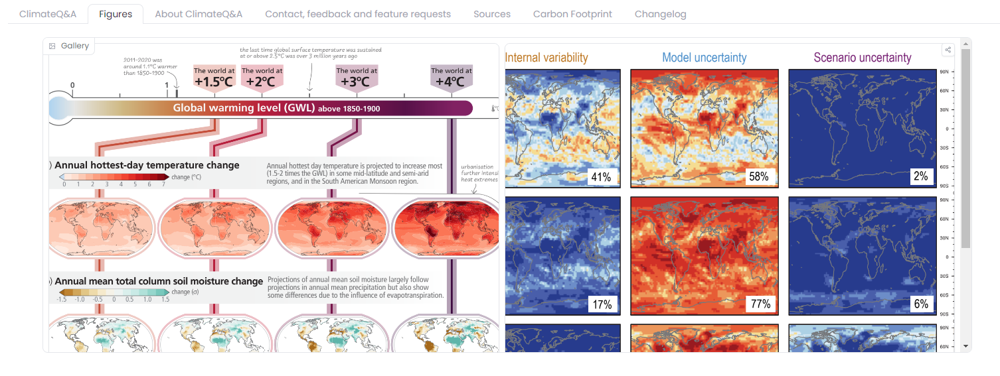
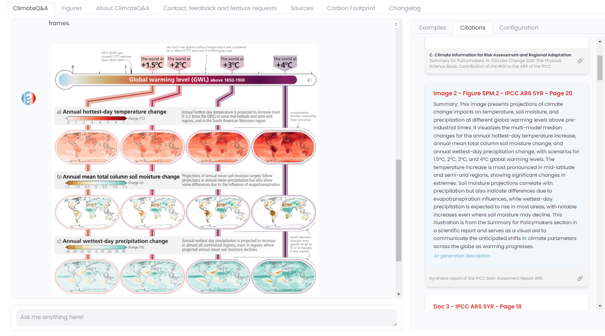

## Abstract

The article discusses the innovative feature introduced in ClimateQ&A version 1.3, which enables the platform to display images alongside explanations, enhancing the user's understanding of complex scientific data. This feature is particularly useful for interpreting scientific reports, such as those from the IPCC and IPBES, which are rich in illustrative images designed to communicate scientific outcomes.

To implement this capability, the system indexes descriptions generated by multimodal Large Language Models (LLMs) into its search engine. For each image, the text before and after it is also captured to provide context, often necessary as the following text frequently acts as the image's caption. These descriptions are then generated using the GPT4Vision API and converted into vectors using the same embedding model as the text, making them searchable within the platform.

## ClimateQ&A now features image interpretation
:::warning[Experimental]

This feature is still in the experimental phase and may undergo changes in the coming months.

:::

Starting from [version 1.3](/docs/changelog/v1.3.0), ClimateQ&A now offers the capability to include images alongside explanations.

The image is displayed within the chat interface at the end of the message, as illustrated above.

This "image interpretation" feature was highly requested, given that scientific reports, such as those from the IPCC and IPBES, often incorporate numerous images designed to convey complex scientific results.

Of course, not all inquiries will return images; the system only provides images when they are relevant to the explanation. Likely images from the referenced passages are accessible under the "Figures" tab.



## How it works

To implement this feature, we index descriptions generated by multimodal Large Language Models (LLMs) in our search engine.

- For this initial release, during the phase of parsing scientific reports, we independently extracted each image (recalling that the document segmentation and parsing are performed using a YOLO model fine-tuned on the [DocLayNet dataset](https://github.com/DS4SD/DocLayNet)).
- For each image, we also retrieve the preceding and following text. This is done to provide the multimodal LLM with the context in which the image is situated, assuming that the following text often serves as the image's caption.
- We then use the GPT4-Vision API to generate descriptions from the image and context texts, using the following prompt:

```
You are going to act as a caption generator. Your goal is NOT to generate a description of the image but more the summary and explanation it conveys. This description will be indexed in a search engine to be found based on a user query.
The images are drawn from the scientific reports of the IPCC on climate change and IPBES on biodiversity. So they are mostly complex science schemas.
If the image is weird, is a logo, looks like it has been wrongly cropped, or you don't know what it is, just return "unknown". 

I also provide the context for the image by giving you the text coming before the image in the document, and the text coming after the image (often a caption for the figure, so it may be useful).

Text before:
{text_before}


Text after:
{text_after}

Summary:
```
- The description is then converted into vectors using the same embedding model as the text and added to the vector store to be searchable in the same way as text chunks.

- Then, at the time of the final synthesis in the interface in response to a question, if one of the k retrieved chunks is an image, we display it at the end, while indicating to the user that the description was AI-generated.



## Next Steps

This is an initial, still experimental feature, but the results are already satisfactory enough to continue work in this direction. Our next steps to improve this feature include:

- Expanding the number of images covered; currently, not all images are analyzed.
- Moving to an open-source model like LLaVA to experiment more quickly and allow for easier replication of experiments.
- Directly indexing figures indexed by the IPCC (e.g., https://www.ipcc.ch/report/ar6/syr/figures/).
- Better integrate images in the response and return several images.
- Improving the caption identification of our detection model.
