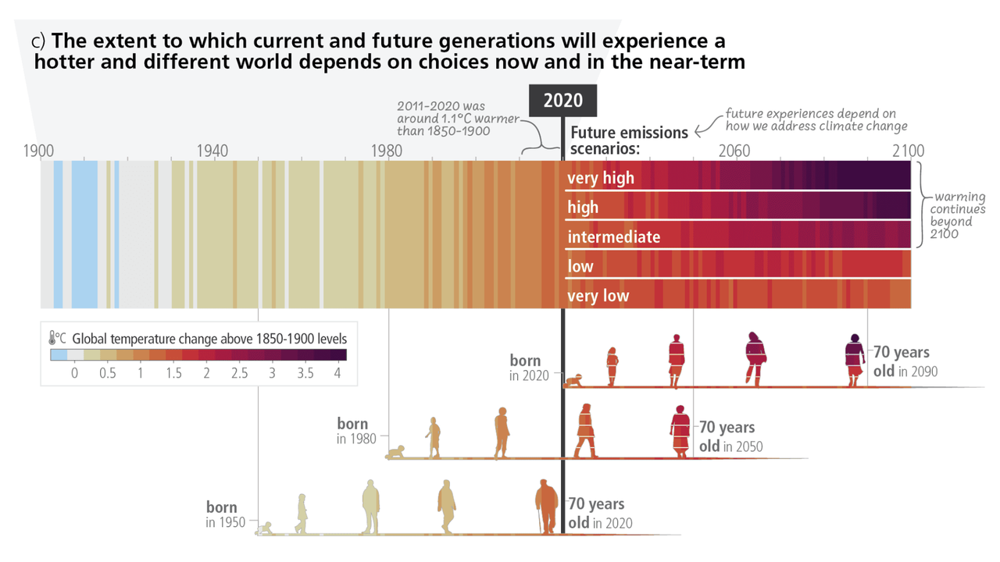

# About ClimateQ&A

## What is ClimateQ&A ?

Climate change and environmental disruptions have become some of the most pressing challenges facing our planet today. As global temperatures rise and ecosystems suffer, it is essential for individuals to understand the gravity of the situation in order to make informed decisions and advocate for appropriate policy changes.

However, comprehending the vast and complex scientific information can be daunting, as the scientific consensus references, such as the Intergovernmental Panel on Climate Change (IPCC) reports, span thousands of pages. To bridge this gap and make climate science more accessible, we introduce ClimateQ&A as a tool to distill expert-level knowledge into easily digestible insights about climate science.

:::tip[How does ClimateQ&A work?]

ClimateQ&A harnesses modern OCR techniques to parse and preprocess IPCC reports. By leveraging state-of-the-art question-answering algorithms, ClimateQ&A is able to sift through the extensive collection of climate scientific reports and identify relevant passages in response to user inquiries. Furthermore, the integration of the ChatGPT API allows ClimateQ&A to present complex data in a user-friendly manner, summarizing key points and facilitating communication of climate science to a wider audience.

:::

> *Figure SPM.1 - IPCC AR6 - Synthesis Report of the IPCC 6th assessment report (AR6)*

## Getting started
- In the chatbot section, simply type your climate-related question, and ClimateQ&A will provide an answer with references to relevant IPCC reports.
    - ClimateQ&A retrieves specific passages from the IPCC reports to help answer your question accurately.
    - Source information, including page numbers and passages, is displayed on the right side of the screen for easy verification.
    - Feel free to ask follow-up questions within the chatbot for a more in-depth understanding.
    - You can ask question in any language, ClimateQ&A is multi-lingual !
- ClimateQ&A integrates multiple sources (IPCC and IPBES, … ) to cover various aspects of environmental science, such as climate change and biodiversity.

## Limitations

:::warning

- Please note that, like any AI, the model may occasionally generate an inaccurate or imprecise answer. Always refer to the provided sources to verify the validity of the information given. If you find any issues with the response, kindly provide feedback to help improve the system.
- ClimateQ&A is specifically designed for climate-related inquiries. If you ask a non-environmental question, the chatbot will politely remind you that its focus is on climate and environmental issues.

:::